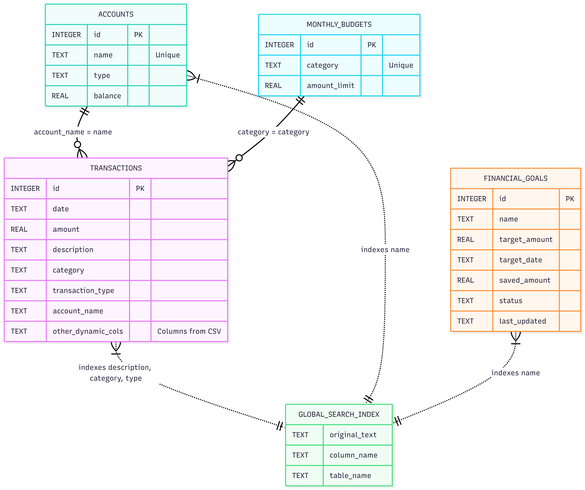
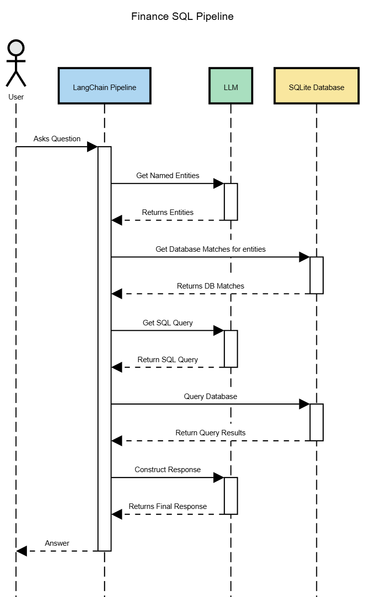
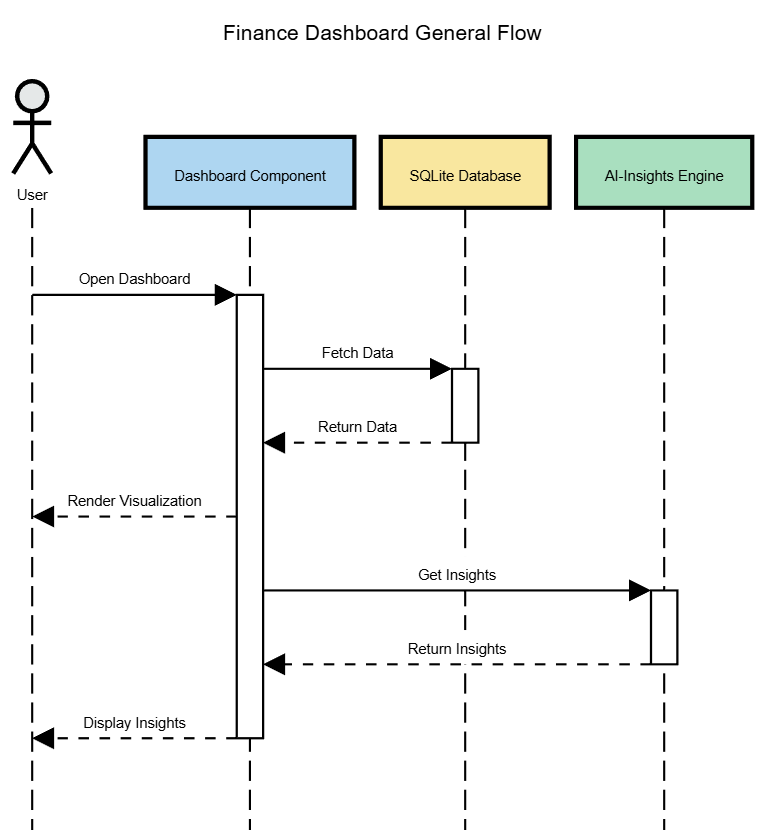

# Smart AI Financial Coach
** Demo:https://vimeo.com/1160883209?share=copy&fl=sv&fe=ci  **

## Local Setup
1. **Install Requirements**: Run `pip install -r requirements.txt` 
2. **Setup Environment Variables**: Create a `.env` file in the root directory based on the `dummy.env` template.
   * Add your `GOOGLE_API_KEY` to access the Google Gemini LLM API.
   * `./config/app_config.yaml` contains app settings like the choice of LLM (default set to Gemini).
3. **Setup Database**:
   * Run the script `python scripts/setup_db.py` to initialize your SQLite database.
4. **Navigate to the UI Directory**: `npm install`, `npm run dev` to start your react app

### Database Schema

#### Why SQL over Graph DB for this use case?
* **Aggregation Performance**: Calculating sums, averages, and monthly trends across hundreds of transactions is more efficient using standard SQL aggregations.
* **Strict Integrity**: Financial data requires the rigid schema enforcement of a relational database to ensure balances always reconcile.

## How the AI Chat Pipeline Works

## How the Dashboard and Insights Work 

## Tech Stack
1. **Frontend**: React, Recharts (JavaScript), Tailwind CSS.
2. **Backend**: Python (Flask), LangChain.
3. **Database**: SQLite.

4. **AI Layer**: Google Gemini LLM.
